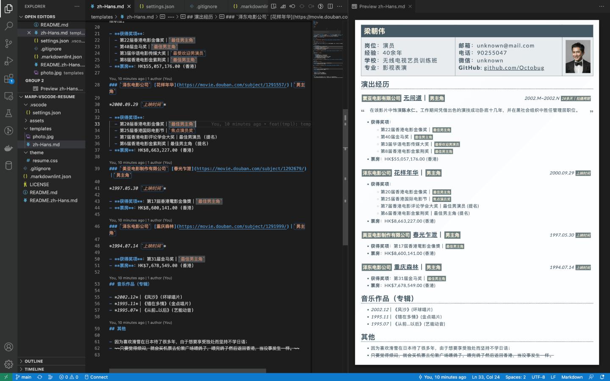

# marp-vscode-resume

`English` | [`简体中文`](README.zh-Hans.md)

- [marp-vscode-resume](#marp-vscode-resume)
  - [Demo](#demo)
  - [Dependencies](#dependencies)
  - [Usage](#usage)
    - [Customizing CSS](#customizing-css)
  - [LICENSE](#license)

A markdown resume template on top of marp-vscode.

This template is intentionally made old fashioned.

> It's a feature, not a bug.

## Demo

Online demo with [the famous actor Tony Leung Chiu-wai's public profile](https://en.wikipedia.org/wiki/Tony_Leung_Chiu-wai):

- [octobug.github.io/marp-vscode-resume](https://octobug.github.io/marp-vscode-resume)

## Dependencies

- [VS Code](https://code.visualstudio.com/)
- VS Code Extensions
  - [marp-vscode](https://github.com/marp-team/marp-vscode)
  - [vscode-markdownlint](https://github.com/DavidAnson/vscode-markdownlint.git) (optional)

## Usage



1. Clone this repo:

    ```sh
    git clone git@github.com:Octobug/marp-vscode-resume.git
    ```

2. Open the repo with VS Code:

    ```sh
    code marp-vscode-resume
    ```

3. Edit this template using markdown syntax: [`templates/zh-Hans.md`](templates/zh-Hans.md)
4. Export file in desired extension using marp-vscode:
    - Keyboard shortcuts: `command/ctrl + shift + p`
    - Then select: `Marp: Export Slide Deck...`

    The best part of marp-vscode is that it can really export a wysiwyg file within these extention formats: [HTML, PDF, PPTX, PNG, JPEG](https://github.com/marp-team/marp-vscode#export-slide-deck-to-html-pdf-pptx-and-image-%EF%B8%8F)

### Customizing CSS

This is a customized style template based on [Marp's gaia theme](https://github.com/marp-team/marp-core/tree/main/themes#gaia) and not an out-of-the-box tool, so you will most likely need to fine-tune the details to your liking.

- The css file of this theme is: [`theme/resume.css`](theme/resume.css)
- For customizing Marp themes, please refer to: [Use custom theme CSS 🛡️](https://github.com/marp-team/marp-vscode#use-custom-theme-css-%EF%B8%8F)
- If you want to further customize the style based on gaia, please refer to its original style sheet: [marp-core/themes/gaia.scss](https://github.com/marp-team/marp-core/blob/main/themes/gaia.scss)

## LICENSE

[Unlicense license](https://github.com/Octobug/marp-vscode-resume/blob/main/LICENSE).

Feel free to modify this template to your preferences by any means.
