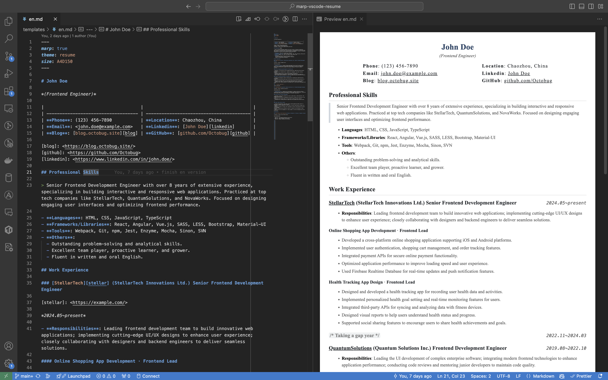

# marp-vscode-resume

*Write your résumé in Markdown*.

`English` | [简体中文](README.zh.md)

## Dependencies

- [VS Code](https://code.visualstudio.com/)
- VS Code Extensions
  - [marp-vscode](https://github.com/marp-team/marp-vscode)
  - [vscode-markdownlint](https://github.com/DavidAnson/vscode-markdownlint.git) (Optional)

## How to Use

> 💡 The resume content is generated by ChatGPT.



1. **Clone this repository**

    ```sh
    $ git clone git@github.com:Octobug/marp-vscode-resume.git
    ```

2. **Open the project in VS Code**

    ```sh
    $ code marp-vscode-resume
    ```

3. **Edit using Markdown syntax**: resume template [`templates/en.md`](templates/en.md)
4. **Export the file**: the best part of **Marp for VS Code** extension is that the exported file is exactly the same as the preview, supporting formats like [HTML, PDF, PPTX, PNG, JPEG](https://github.com/marp-team/marp-vscode#export-slide-deck-to-html-pdf-pptx-and-image-%EF%B8%8F)

    - Shortcut: `command/ctrl + shift + p`
    - Select: `Marp: Export Slide Deck...`

### Command Line Tools (Optional)

```sh
$ nvm use
$ npm install

# Formats: html|jpeg|png|pdf|pptx
$ npm run pdf
$ tree resumes 
resumes
├── en.pdf
└── zh.pdf
```

### Customizing CSS

This is a template modified based on the [Marp Gaia theme](https://github.com/marp-team/marp-core/tree/main/themes#gaia), not an out-of-the-box tool, so you may need to tweak details according to your preferences.

- The theme style file is [`.marp/theme.css`](.marp/theme.css)
- For customizing Marp themes, please refer to: [Use custom theme CSS 🛡️](https://github.com/marp-team/marp-vscode#use-custom-theme-css-%EF%B8%8F)
- If you want to further customize styles based on Gaia, please refer to its original style file: [marp-core/themes/gaia.scss](https://github.com/marp-team/marp-core/blob/main/themes/gaia.scss)

#### Debugging CSS?

1. Export the HTML file
2. Use the browser's developer tools

## License

[MIT License](./LICENSE)

Copyright © 2023 Shaobiao Lin
