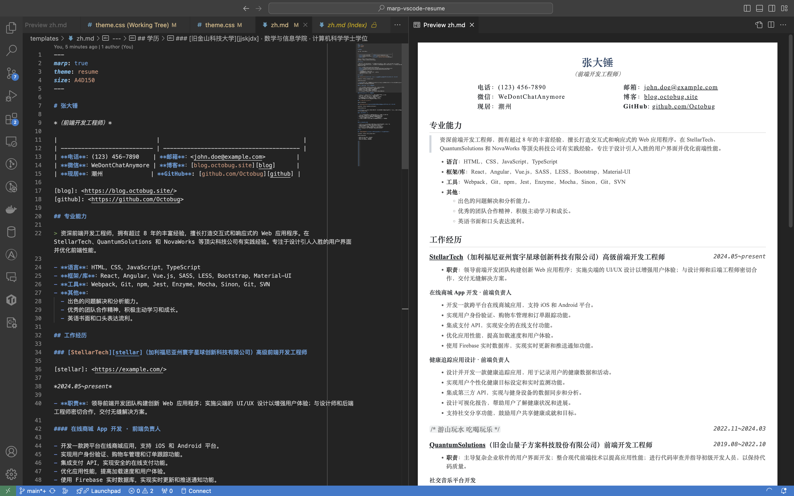

# marp-vscode-resume

*使用 Markdown 编写简历*。

[English](README.md) | `简体中文`

## 依赖

- [VS Code](https://code.visualstudio.com/)
- VS Code 插件
  - [marp-vscode](https://github.com/marp-team/marp-vscode)
  - [vscode-markdownlint](https://github.com/DavidAnson/vscode-markdownlint.git)（可选）

## 如何使用

> 💡 简历内容来自 ChatGPT。



1. **克隆本仓库**

    ```sh
    git clone git@github.com:Octobug/marp-vscode-resume.git
    ```

2. **使用 VS Code 打开项目**

    ```sh
    code marp-vscode-resume
    ```

3. **使用 Markdown 语法编辑**：简历模板 [`templates/zh.md`](templates/zh.md)
4. **导出文件**：Marp for VS Code 这个插件最好的地方在于，它导出的文件和预览效果完全一致，支持的格式有：[HTML, PDF, PPTX, PNG, JPEG](https://github.com/marp-team/marp-vscode#export-slide-deck-to-html-pdf-pptx-and-image-%EF%B8%8F)

    - 快捷键：`command/ctrl + shift + p`
    - 选择：`Marp: Export Slide Deck...`

### 命令行工具（可选）

```sh
nvm use
npm install

# 格式：html|jpeg|png|pdf|pptx
npm run pdf
tree resumes 
resumes
├── en.pdf
└── zh.pdf
```

### 自定义 CSS

这是一个基于 [Marp gaia 主题](https://github.com/marp-team/marp-core/tree/main/themes#gaia) 修改的模板，而不是一个开箱即用的工具，因此你很可能需要根据自己的偏好修改细节。

- 主题样式文件为 [`.marp/theme.css`](.marp/theme.css)
- 关于自定义 Marp 主题，请参考：[Use custom theme CSS 🛡️](https://github.com/marp-team/marp-vscode#use-custom-theme-css-%EF%B8%8F)
- 如果想进一步基于 gaia 自定义样式，请参考其原始样式文件：[marp-core/themes/gaia.scss](https://github.com/marp-team/marp-core/blob/main/themes/gaia.scss)

#### 调试 CSS？

1. 导出 HTML 文件
2. 使用浏览器开发者工具

## 许可

[MIT License](./LICENSE)

Copyright © 2023 Shaobiao Lin
