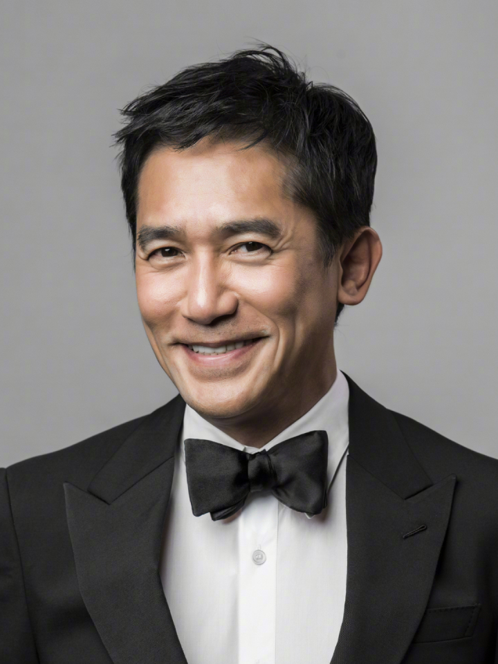

| Tony Leung Chiu-wai                                                                            |                                                                                                                                                   |                               |
| ---------------------------------------------------------------------------------------------- | ------------------------------------------------------------------------------------------------------------------------------------------------- | ----------------------------- |
| **Status**: Actor   **Experience**: 40+yrs.   **Education**:  TVB   **Major**: Acting | **Email**: unknown@mail.com   **Phone**: 90255047   **Telegram**: unknown   **GitHub**: [github.com/Octobug](https://github.com/Octobug) |  |

## Acting Experiences

### `Media Asia Films` [*Infernal Affairs*](https://www.imdb.com/title/tt0338564/) | `Leading Actor`

*2002.M~2002.N `20+days | Shooting`*

> Played Chan Wing-yan in the film. Successfully went undercover for more than ten years with excellent acting skills, and was qualified for management positions in underworld organizations during the work.

- **Awards**:
  - Hong Kong Film Award | `Best Actor`
  - Golden Horse Award | `Best Actor`
  - Golden Bauhinia Award | `Best Actor`
- **Box Office**: HK$55,057,176.00 (Hong Kong)

### `Jet Tone Production` [*In the Mood for Love*](https://www.imdb.com/title/tt20833922/) | `Leading Actor`

*2000.09.29 `Release Date`*

- **Awards**:
  - Cannes Film Festival | `Best Actor`
  - Hong Kong Film Award | `Best Actor`
  - Golden Horse Award | Best Actor (Nominated)
- **Box Office**: HK$8,663,227.00 (Hong Kong)

### `Mei Ah Entertainment Group` [*Happy Together*](https://www.imdb.com/title/tt0118845/) | `Leading Actor`

*1997.05.30 `Release Date`*

- **Awards**: Hong Kong Film Award | `Best Actor`
- **Box Office**: HK$8,600,141.00 (Hong Kong)

### `Jet Tone Production` [*Chungking Express*](https://www.imdb.com/title/tt0109424/) | `Leading Actor`

*1994.07.14 `Release Date`*

- **Awards**: Golden Horse Award | `Best Actor`
- **Box Office**: HK$7,678,549.00 (Hong Kong)

## Musical Works (Albums)

- *2002.12* | *Wind Sand* (Universal Music Group)
- *1995.11* | *The Fault Is Too Much Love* (Golden Point Records)
- *1995.07* | *The Past... The Future* (Music Impact Entertainment)

## Others

- Have been staying in Japan for many years, but insist on not learning Japanese for enjoying being alone;
- ~~Fly to London to feed the pigeons when feeling bored then return to Hong Kong as if nothing happened.~~
