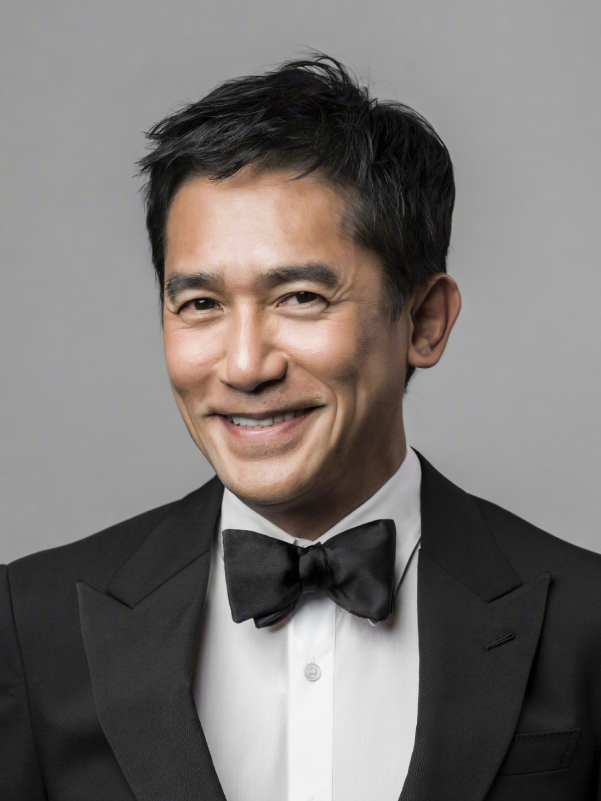

| 梁朝伟                                                                                                               |                                                                                                                                                      |                             |
| -------------------------------------------------------------------------------------------------------------------- | ---------------------------------------------------------------------------------------------------------------------------------------------------- | --------------------------- |
| **岗位**：演员   **经验**：40余年   **学校**：无线电视艺员训练班   **专业**：影视表演 | **邮箱**：unknown@mail.com   **电话**：90255047   **微信**：unknown   **GitHub**: [github.com/Octobug](https://github.com/Octobug) |  |

## 演出经历

### `寰亚电影有限公司` [无间道](https://movie.douban.com/subject/1307914/)｜`男主角`

*2002.M~2002.N `20多天｜拍摄周期`*

> 在该影片中饰演**陈永仁**。工作期间凭借出色的演技成功卧底十几年，并在黑社会组织中胜任管理层职位。

- **获得奖项**：
  - 第22届香港电影金像奖｜`最佳男主角`
  - 第40届金马奖｜`最佳男主角`
  - 第3届华语电影传媒大奖｜`最受欢迎男演员`
  - 第8届香港电影金紫荆奖｜`最佳男主角`
- **票房**：HK$55,057,176.00 (香港)

### `泽东电影公司` [花样年华](https://movie.douban.com/subject/1291557/)｜`男主角`

*2000.09.29 `上映时间`*

- **获得奖项**：
  - 第20届香港电影金像奖｜`最佳男主角`
  - 第25届香港国际电影节｜`焦点演员奖`
  - 第7届香港电影评论学会大奖｜最佳男演员 (提名)
  - 第6届香港电影金紫荆奖｜最佳男主角 (提名)
- **票房**：HK$8,663,227.00 (香港)

### `美亚电影制作有限公司` [春光乍泄](https://movie.douban.com/subject/1292679/)｜`男主角`

*1997.05.30 `上映时间`*

- **获得奖项**：第17屆香港電影金像獎｜`最佳男主角`
- **票房**：HK$8,600,141.00 (香港)

### `泽东电影公司` [重庆森林](https://movie.douban.com/subject/1291999/)｜`男主角`

*1994.07.14 `上映时间`*

- **获得奖项**：第31届金马奖｜`最佳男主角`
- **票房**：HK$7,678,549.00 (香港)

## 音乐作品（专辑）

- *2002.12*｜《风沙》(环球唱片)
- *1995.11*｜《错在多情》(金点唱片)
- *1995.07*｜《从前…以后》(艺能动音)

## 其他

- 因为喜欢滑雪在日本待了很多年，由于想要享受独处而坚持不学日语；
- ~~只要觉得烦闷，就会买机票去伦敦广场喂鸽子，喂完鸽子然后返回香港，当没事发生一样。~~
